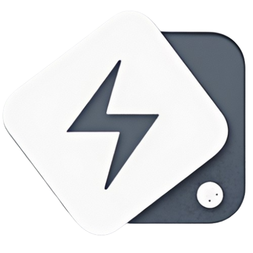

# App Icon Generator 

[English](#english) | [中文](#chinese)

<a name="chinese"></a>
## 中文

一个现代化的Web应用，用于自动生成AppStore和Google Play应用商店所需的各种尺寸App图标。

### 目录
- [功能特点](#功能特点)
- [技术栈](#技术栈)
- [开始使用](#开始使用)
- [使用方法](#使用方法)
- [支持的图标尺寸](#支持的图标尺寸)

## 功能特点

- 简单易用的拖放上传界面
- 实时预览不同尺寸的应用图标
- 一键生成AppStore所需的所有iOS和macOS图标尺寸
- 一键生成Google Play所需的所有Android图标尺寸
- 以ZIP格式打包下载，包含所有尺寸的图标

## 技术栈

- Next.js - React框架
- TypeScript - 类型安全的JavaScript
- Tailwind CSS - 实用优先的CSS框架
- React Dropzone - 文件上传组件
- JSZip - 生成ZIP文件
- File Saver - 客户端文件保存

## 开始使用

### 安装依赖

```bash
npm install
```

### 启动开发服务器

```bash
npm run dev
```

访问 [http://localhost:3000](http://localhost:3000) 查看应用。

### 构建生产版本

```bash
npm run build
```

### 启动生产服务器

```bash
npm run start
```

## 使用方法

1. 上传一张高质量的图片（建议尺寸1024×1024像素）
2. 查看不同尺寸的图标预览
3. 点击"生成所有尺寸图标"按钮
4. 下载AppStore或Google Play图标包

## 支持的图标尺寸

### AppStore图标尺寸
- 1024×1024 (App Store)
- 180×180 (iPhone)
- 167×167 (iPad Pro)
- 152×152 (iPad)
- 120×120 (iPhone)
- 以及更多...

### Google Play图标尺寸
- 512×512 (Play Store)
- 192×192 (Android)
- 144×144 (Android)
- 96×96 (Android)
- 以及更多...

<a name="english"></a>
## English

A modern web application for automatically generating app icons in various sizes required by the AppStore and Google Play Store.

### Table of Contents
- [Features](#features)
- [Tech Stack](#tech-stack)
- [Getting Started](#getting-started)
- [How to Use](#how-to-use)
- [Supported Icon Sizes](#supported-icon-sizes)

### Features

- Simple drag-and-drop upload interface
- Real-time preview of different icon sizes
- One-click generation of all iOS and macOS icon sizes for AppStore
- One-click generation of all Android icon sizes for Google Play
- Download all sizes in a ZIP package

### Tech Stack

- Next.js - React Framework
- TypeScript - Type-safe JavaScript
- Tailwind CSS - Utility-first CSS Framework
- React Dropzone - File Upload Component
- JSZip - ZIP File Generation
- File Saver - Client-side File Saving

### Getting Started

#### Install Dependencies

```bash
npm install
```

#### Start Development Server

```bash
npm run dev
```

Visit [http://localhost:3000](http://localhost:3000) to view the application.

#### Build for Production

```bash
npm run build
```

#### Start Production Server

```bash
npm run start
```

### How to Use

1. Upload a high-quality image (recommended size: 1024×1024 pixels)
2. Preview different icon sizes
3. Click "Generate All Icon Sizes" button
4. Download AppStore or Google Play icon package

### Supported Icon Sizes

#### AppStore Icon Sizes
- 1024×1024 (App Store)
- 180×180 (iPhone)
- 167×167 (iPad Pro)
- 152×152 (iPad)
- 120×120 (iPhone)
- And more...

#### Google Play Icon Sizes
- 512×512 (Play Store)
- 192×192 (Android)
- 144×144 (Android)
- 96×96 (Android)
- And more...
